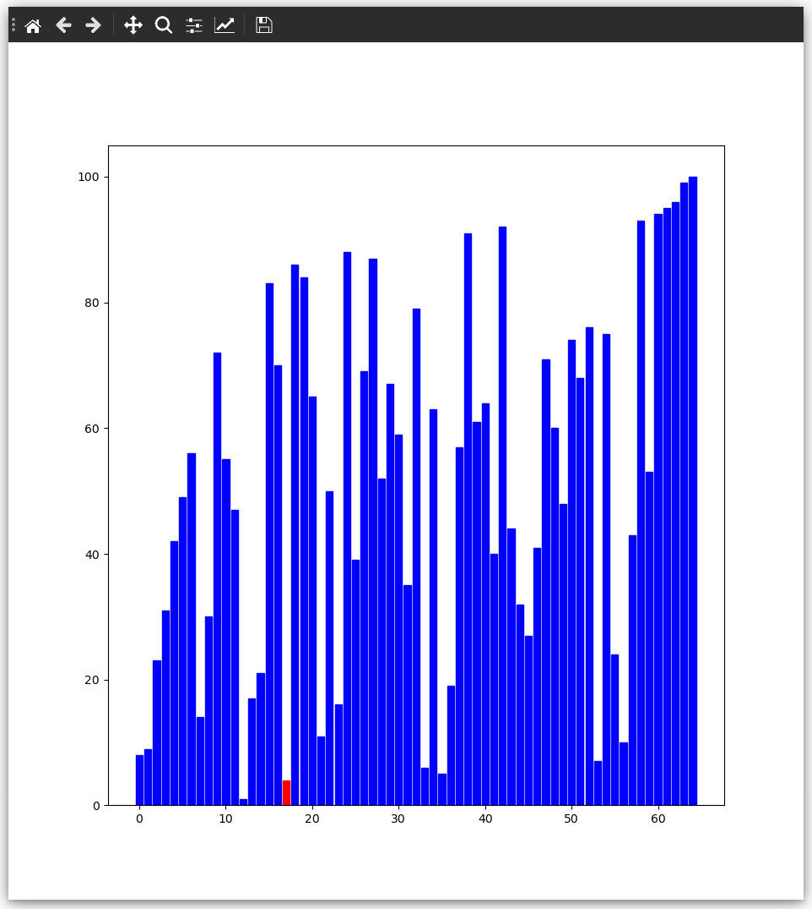

# Sorting algorithm visualizer by Florian Thürkow

I made a sorting algorithm visualizer using matplotlib. The visualizer currently supports quicksort, bubblesort and merge sort.

## Installation

Clone the git repository and then run the following commands inside that directory. I will assume you have a version of python 3.X installed

```
$ pip3 install -r requirements.txt # install requirements
$ python3 main.py # launch program
```

## Usage

At launch you will be asked to input an array. I have also implemented randomized arrays as a feature.

Afterwards you will be asked to pick a sorting algorithm.

When the algorithm is done you can once again shuffle the array and try out a new sorting algorithm.

## Screenshots


